# ALGOViz v2.0 Architecture - Hydra-zen First Event Flow

## Complete System Architecture Diagram

```mermaid
graph TB
    %% External Inputs
    StoryboardYAML[("📄 Storyboard YAML<br/>acts → shots → beats")]
    SceneConfigYAML[("⚙️ Scene Config YAML<br/>BFSBasicSceneConfig")]
    ScenarioYAML[("🗺️ Scenario YAML<br/>maze_small.yaml")]
    
    %% Hydra-zen ConfigStore
    ConfigStore[("🏪 ConfigStore<br/>hydra-zen registry")]
    
    %% Core Components
    Director["🎬 Director<br/>(Pure Orchestrator)"]
    SceneEngine["🎭 SceneEngine<br/>(Action Executor)"]
    Storyboard["📋 Storyboard<br/>(Data Model)"]
    
    %% Scene Configuration System
    SceneConfig["🎨 Scene Configuration<br/>(Hydra-zen Structured Config)"]
    EventBindings["🔗 Event Bindings<br/>(Event → Widget Actions)"]
    WidgetSpecs["🧩 Widget Specifications<br/>(Hydra-zen _target_)"]
    
    %% Algorithm System
    AdapterRegistry["📚 Adapter Registry<br/>(Algorithm Registry)"]
    BFSAdapter["🔍 BFS Adapter<br/>(VizEvent Generator)"]
    ScenarioLoader["🗺️ Scenario Loader<br/>(Grid/Graph Data)"]
    VizEvents[("⚡ VizEvents<br/>enqueue, dequeue, goal_found")]
    
    %% Widget System
    Widgets["🎨 Widgets<br/>(Grid, Queue, Legend)"]
    ParameterResolution["🔄 Parameter Resolution<br/>(OmegaConf Resolvers)"]
    
    %% Timing & Voiceover
    TimingConfig["⏱️ Timing Config<br/>(Duration Buckets)"]
    TimingTracker["📊 Timing Tracker<br/>(Performance Metrics)"]
    VoiceoverContext["🎤 Voiceover Context<br/>(Narration Sync)"]
    
    %% Flow Connections - Hydra-zen First
    StoryboardYAML -->|"yaml.load()"| Storyboard
    SceneConfigYAML -->|"builds() + make_config()"| ConfigStore
    ScenarioYAML -->|"yaml.load()"| ScenarioLoader
    
    ConfigStore -->|"instantiate(scene_config)"| SceneConfig
    SceneConfig -->|"contains"| EventBindings
    SceneConfig -->|"contains"| WidgetSpecs
    
    %% Director Orchestration (Pure)
    Director -->|"run()"| Storyboard
    Storyboard -->|"acts → shots → beats"| Director
    Director -->|"delegate ALL actions"| SceneEngine
    
    %% SceneEngine Action Execution
    SceneEngine -->|"execute_beat()"| SceneConfig
    SceneEngine -->|"instantiate() widgets"| WidgetSpecs
    SceneEngine -->|"handle_event()"| EventBindings
    
    %% Algorithm Event Generation
    SceneEngine -->|"play_events action"| AdapterRegistry
    AdapterRegistry -->|"get('bfs')"| BFSAdapter
    SceneEngine -->|"load scenario"| ScenarioLoader
    BFSAdapter -->|"run(scenario)"| VizEvents
    
    %% Event Processing Flow
    VizEvents -->|"event.type lookup"| EventBindings
    EventBindings -->|"resolve parameters"| ParameterResolution
    ParameterResolution -->|"${event.*}, ${config.*}"| VizEvents
    ParameterResolution -->|"${timing.*}"| TimingConfig
    EventBindings -->|"call widget methods"| Widgets
    
    %% Timing & Voiceover Integration
    Director -->|"timing.base_for()"| TimingConfig
    Director -->|"log timing"| TimingTracker
    Director -->|"narration sync"| VoiceoverContext
    
    %% Styling
    classDef hydraZen fill:#e1f5fe,stroke:#01579b,stroke-width:3px
    classDef orchestrator fill:#f3e5f5,stroke:#4a148c,stroke-width:2px
    classDef executor fill:#e8f5e8,stroke:#1b5e20,stroke-width:2px
    classDef data fill:#fff3e0,stroke:#e65100,stroke-width:2px
    classDef registry fill:#fce4ec,stroke:#880e4f,stroke-width:2px
    
    class ConfigStore,SceneConfig,WidgetSpecs,EventBindings hydraZen
    class Director orchestrator
    class SceneEngine executor
    class Storyboard,VizEvents,TimingConfig,TimingTracker,VoiceoverContext data
    class AdapterRegistry,ScenarioLoader registry
```

## Event Flow Sequence

```mermaid
sequenceDiagram
    participant S as Storyboard
    participant D as Director
    participant SE as SceneEngine
    participant SC as SceneConfig
    participant AR as AdapterRegistry
    participant BFS as BFSAdapter
    participant SL as ScenarioLoader
    participant EB as EventBindings
    participant W as Widgets
    
    Note over S,W: Hydra-zen First Event Flow
    
    %% Initialization
    S->>D: load storyboard (acts→shots→beats)
    SC->>SE: instantiate(scene_config)
    
    %% Orchestration Loop
    loop For each act→shot→beat
        D->>SE: execute_beat(beat, run_time, context)
        
        alt beat.action == "play_events"
            SE->>AR: get_algorithm("bfs")
            AR->>BFS: instantiate adapter
            SE->>SL: load_scenario("maze_small")
            SL->>BFS: provide scenario data
            
            loop For each algorithm step
                BFS->>SE: yield VizEvent(type="enqueue", payload={node})
                SE->>EB: lookup_event_bindings("enqueue")
                EB->>SE: return EventBinding list
                
                loop For each event binding
                    SE->>W: resolve_parameters(${event.node})
                    SE->>W: call widget.action(enqueue, resolved_params)
                    W->>SE: action completed
                end
            end
            
        else beat.action == "show_title"
            SE->>SC: get_scene_action("show_title")
            SC->>SE: return action handler
            SE->>W: execute scene action
            
        else beat.action == "place_start"
            SE->>SC: get_algorithm_action("place_start")
            SC->>SE: return action handler
            SE->>W: execute algorithm action
        end
        
        SE->>D: beat execution completed
    end
```

## Component Relationships

```mermaid
graph LR
    %% Core Architecture Layers
    subgraph "🎬 Orchestration Layer"
        Director["Director<br/>(Pure Orchestrator)"]
    end
    
    subgraph "🎭 Execution Layer"
        SceneEngine["SceneEngine<br/>(Action Executor)"]
    end
    
    subgraph "⚙️ Configuration Layer (Hydra-zen First)"
        ConfigStore["ConfigStore"]
        SceneConfig["Scene Config<br/>(Structured Config)"]
        EventBindings["Event Bindings<br/>(Event → Actions)"]
        WidgetSpecs["Widget Specs<br/>(_target_ configs)"]
    end
    
    subgraph "🔍 Algorithm Layer"
        AdapterRegistry["Adapter Registry"]
        BFSAdapter["BFS Adapter"]
        ScenarioLoader["Scenario Loader"]
        VizEvents["VizEvents"]
    end
    
    subgraph "🎨 Widget Layer"
        Widgets["Widgets<br/>(Grid, Queue, Legend)"]
        ParameterResolution["Parameter Resolution<br/>(OmegaConf Resolvers)"]
    end
    
    subgraph "⏱️ Cross-Cutting Concerns"
        TimingConfig["Timing Config"]
        TimingTracker["Timing Tracker"]
        VoiceoverContext["Voiceover Context"]
    end
    
    %% Relationships
    Director -->|"delegates to"| SceneEngine
    SceneEngine -->|"uses"| SceneConfig
    SceneEngine -->|"processes"| EventBindings
    SceneEngine -->|"instantiates"| WidgetSpecs
    SceneEngine -->|"executes"| AdapterRegistry
    AdapterRegistry -->|"generates"| VizEvents
    EventBindings -->|"routes to"| Widgets
    ParameterResolution -->|"resolves templates"| VizEvents
    
    %% Styling
    classDef layer fill:#f5f5f5,stroke:#333,stroke-width:2px
    classDef hydraZen fill:#e3f2fd,stroke:#1976d2,stroke-width:3px
    
    class ConfigStore,SceneConfig,EventBindings,WidgetSpecs hydraZen
```

## Key Architectural Principles

### 1. **Hydra-zen First**
- All configurations use `builds()` and `make_config()`
- SceneEngine instantiated with `instantiate(scene_config)`
- Widget specifications use `_target_` patterns
- ConfigStore provides centralized configuration registry

### 2. **Pure Orchestration**
- Director knows nothing about specific actions
- Director just executes storyboard structure (acts→shots→beats)
- All action execution delegated to SceneEngine

### 3. **Event-Driven Parameter Resolution**
- Static widget configs + dynamic event parameters
- OmegaConf resolvers: `${event.*}`, `${config.*}`, `${timing.*}`
- Scene configurations define event bindings
- Runtime parameter resolution with full context

### 4. **Separation of Concerns**
- **Director**: Orchestration only
- **SceneEngine**: Action execution and event processing
- **Scene Config**: Algorithm-specific behavior definition
- **Adapters**: Algorithm execution and event generation
- **Widgets**: Visual representation and interaction
